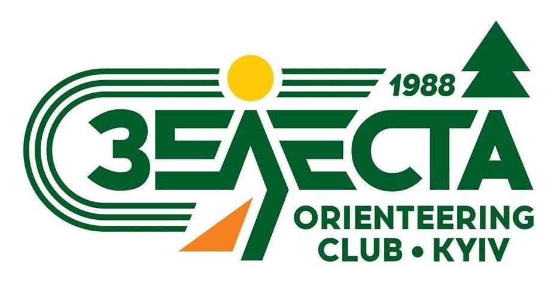

# Користування QR-O-Punch

## Віртуальний полігон

 * Запустити програму відмітки на смартфоні: адреса [https://sakhnik.com/qr](https://sakhnik.com/qr)
 * На іншому телефоні або комп’ютері відкрити тестовий полігон: [https://sakhnik.com/qr/stage.html](https://sakhnik.com/qr/stage.html)
 * Задати бажані параметри, натиснути «Enter»
 * Сканувати відображений код, перейти до наступної сторінки, натиснувши на відповідну кнопку на екрані (або клавішу «пропуск»).

## Інструкція

Для фіксації проходження КП (контрольних пунктів) на дистанції, учаснику
необхідно мати смартфон бажано з доступом до мобільного інтернету. Далі
потрібно відкрити в браузері на телефоні веб-додаток. Для тих учасників
змагань, у котрих відсутній мобільний інтернет, організатори можуть надати
інтернет, щоб відкрити необхідний веб-додаток. Під час проходження дистанції
наявність інтернету не потрібна. Необхідність інтернету може виникнути лише в
разі потреби перезавантаження програми через помилку користувача або
програмно-апаратний збій. На фініші організатори також можуть надати
підключення до мережі інтернет для фіксації проходження дистанції.

Веб-додаток розрахований на роботу у
веб-браузерах Google Chrome ([Android Play Market](https://play.google.com/store/apps/details?id=com.android.chrome),
[Apple App Store](https://apps.apple.com/gb/app/google-chrome/id535886823)),
Mozilla Firefox ([Android Play Market](https://play.google.com/store/apps/details?id=org.mozilla.firefox),
[Apple App Store](https://apps.apple.com/us/app/firefox-private-safe-browser/id989804926)).
При запуску додатку в іншому
веб-браузері коректність відображення даних і роботи веб-додатку не
гарантується. Для роботи з веб-додатком маючи активне підключення до мережі
інтернет учасникам необхідно відкрити веб-сторінку [https://sakhnik.com/qr](https://sakhnik.com/qr),
запам'ятати її або додати у закладки для подальшого використання на дистанції.
Для роботи з веб-додатком без активного підключення до мережі інтернет
учасникам необхідно налаштувати у себе на телефоні HTTP Server (рекомендовані
інструкції для цього наведені нижче) до старту і на старті запустити
веб-додаток для сканування електронної відмітки.

При запуску веб-додатку слід надати дозвіл на доступ до камери і служб
місцезнаходження. При проходженні реєстрації необхідно відсканувати код у
організаторів для встановлення стартового номеру учасника. Для реєстрації
відмітки потрібно розблокувати смартфон і відсканувати графічний код на
передстарті (перевірка і очищення), старті, контрольних пунктах і фініші.
Зелений індикатор на екрані смартфона і звуковий сигнал підтверджують успішне
сканування відмітки. Так само треба відсканувати код після фінішу, щоб
зареєструвати інформацію про відмітки у суддівську систему та отримати
роздруківку проходження дистанції.
Якщо стався який-небудь збій веб-додатку чи пристрою, в будь-який момент можна
перезавантажити додаток з адреси
[https://sakhnik.com/qr](https://sakhnik.com/qr)
або [http://localhost:8080](http://localhost:8080) відповідно.
При цьому вся попередня інформація
зберігається. Якщо можливості перезавантажити учаснику немає, необхідно робити
фото на кожному наступному КП для пред'явлення секретаріату.

Підтримувана функціональність веб-додатку при запуску через веб-браузери
Google Chrome і Mozilla Firefox:

|  Функція        |  Google Chrome |  Mozilla Firefox |
|-----------------|----------------|------------------|
| Сканування      |  `✅`          |  `✅`            |
| Геолокація      |  `✅`          |  `✅`            |
| Звуковий сигнал |  `✅`          |  `✅`            |
| Вібрація        |  `✅`          |  `❌`            |
| Підсвітка       |  `✅`          |  `❌`            |

## Економія заряду батареї

Веб-додаток запускає камеру і використовує її та служби геолокації в постійному
активному режимі, тому під час його роботи відбувається значне споживання
заряду батареї. Тож на перегонах між контрольними пунктами організатори
радять вимикати екран смартфону задля економії заряду.
При цьому сканер також буде призупинено до наступного розблокування смартфону.

## Запуск без мобільного інтернету

### На смартфоні Android

* Встановити [Simple HTTP Server](https://play.google.com/store/apps/details?id=com.phlox.simpleserver)
* Завантажити архів програми з адреси [https://sakhnik.com/qr.zip](https://sakhnik.com/qr.zip)
* Розпакувати (витягнути) файли з архіву в /sdcard/Download/qr/
* Запустити додаток Simple HTTP Server
* Задати Root folder -> External folder -> /sdcard/Download/qr
* Натиснути START
* Запустити навігатор тенет Google Chrome або Mozilla Firefox
* Перейти до адреси [http://localhost:8080/](http://localhost:8080/)

Програма готова до сканування кодів електронної відмітки.

### На смартфоні iOS

* Встановити додаток [iSH Shell](https://apps.apple.com/us/app/ish-shell/id1436902243)
* В додатку iSH Shell інсталювати python3, ввівши команду `apk add python3`. У спливаючому повідомленні
  дозволити пошук та підключення до пристроїв в локальній мережі.
* Під час інсталяції python3 не згортайте додаток iSH, адже викачування і інсталяція в фоновому режимі не
  відбувається
* Завантажити архів програми з адреси [https://sakhnik.com/qr.zip](https://sakhnik.com/qr.zip)
* Розпакувати (витягнути) файли з архіву. Розпаковану теку qr перемістити в `/iSH/root/`
* В додатку iSH Shell запустити локальний веб-сервер, ввівши команду `python3 -m http.server`
* Запустити навігатор тенет Google Chrome або Mozilla Firefox
* Перейти до адреси [http://localhost:8000/](http://localhost:8000/)

## Консультації і підтримка

Джерело: [sakhnik/qr-o-punch](https://github.com/sakhnik/qr-o-punch)

Розроблено в клубі спортивного орієнтування Зелеста. З питаннями про застосування системи, підготовки, організації і проведення спортивних заходів,
звертайтеся до контактів на сторінці у Facebook: [ZELESTAclub](https://www.facebook.com/ZELESTAclub).
